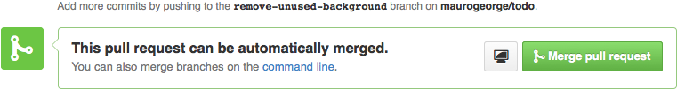
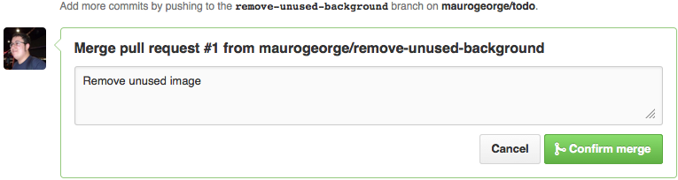
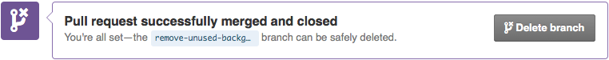

# HE:mobile Blog

## Criando seu post

1) Clone o repositório [git@github.com:Helabs/blog.git](https://github.com/Helabs/blog) e tenha certeza de que está no branch `gh-pages`.

2) Crie um arquivo em `_drafts/titulo-do-seu-post.markdown` com o seguinte formato.

```
---
published: false
author: Seu Nome
layout: post
title: "Título"
date: AAAA-MM-DD HH:MM
comments: true
categories:
  - Tag1
  - Tag2
---

Conteúdo do post
```

3) Veja se ficou bom executando o projeto com --drafts e acessando pelo browser o endereço [http://localhost:4000/blog/](http://localhost:4000/blog/) (Precisa de "/" no final do endereço).

4) Commit as mudanças.

```
$ git add .
$ git commit -am 'post: Titulo do seu post'
```

5) Push na branch.

```
$ git push origin gh-pages
```

## Dependencies

To run this project you need to have:

* Ruby 2.1.2 - You can use [RVM](http://rvm.io)

## Setup the project

1. Install the depedencies above
2. Clone the project

        $ git clone git@github.com:Helabs/blog.git

3. Go into the project folder

        $ cd blog

4. Install the gem dependencies

        $ bundle install

If everything goes OK, you can now run the project!

## Running the project

1. Start the server

        $ bundle exec foreman start

2. Open [http://localhost:4000/blog/](http://localhost:4000/blog/), don't forget to put trailing '/'.

## Creating your post

1. This create a file and the branch for your post using the rake task below.

        $ rake 'new_post["Title of the post"]'

1. Write your post and **make sure the author link on the post points to your profile on HE:labs website**.
1. Commit your changes.

        $ git add .
        $ git commit -am 'post: Title of the post'

1. Push the branch.

        $ git push --set-upstream origin post/title-of-the-post

1. Send a pull request by GitHub web interface.

### Markdown

The syntax used by the blog is the markdown, you can take a look at this [cheatsheet](http://markdown.chibi.io/) for more info.

#### Code Highlighting

Use the following syntax:

```

class Say
  def hello
    say "Hello!"
  end
end

```

#### Images

Save your images in `/images/posts/YYYY-MM-DD/`. Your image URL will look like this: `/blog/images/posts/YYYY-MM-DD/`.

#### Create a list

For create a list on your post, always use hifen (the "-"), like this:

```
- item1
- item2
- item3
```

And it will look like this:

- item1
- item2
- item3

Don't use asterisk, otherwise the list will break.

## Publishing a post

1. Open the pull request's page
1. Check if the publish date is correct on the post filename. It should be the current day. If it's wrong, ask the author to fix it.
1. Click the "Merge pull request" button

    

1. Click the "Confirm merge" button

    

1. Click the "Delete branch" button

    

1. Wait a little bit and access the blog to see the new post

## Removing links to authors that are no longer on the team from blog posts

Run:

```sh
rake fix_author_links
```

Then double check if the posts were changed correctly, `git commit` and `git push` the changes back to the `gh-pages` branch.

## LICENSE

[Blog da HE:mobile](http://hemobile.com.br/blog/) e seu conteúdo está licenciado sob uma [licença Creative Commons Atribuição-NãoComercial-CompartilhaIgual 3.0 Não Adaptada](http://creativecommons.org/licenses/by-nc-sa/3.0/deed.pt_BR).
